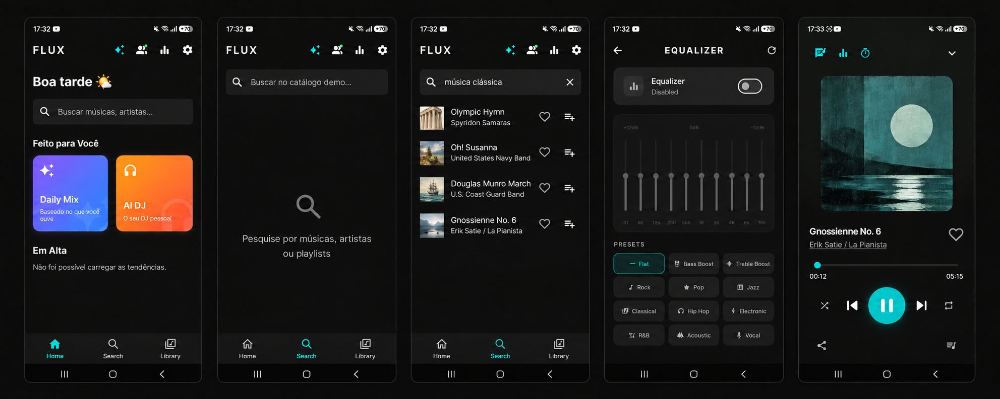

<div align="center">
  
  <h1>Flux</h1>
  <p>Uma experiência musical feita em Flutter — edição pública de demonstração.</p>

  
  
  
  
</div>



## Sobre o projeto

Flux é um aplicativo de música criado para demonstrar arquitetura Flutter, gerenciamento de estado, reprodução de áudio, playlists, busca, autenticação e recursos sociais. Este repositório contém somente a edição pública de portfólio.

A busca e o player são limitados por uma lista de permissão em `DemoCatalogService`. Cada item carrega identificador interno, origem da gravação, URL de áudio e licença. O aplicativo rejeita qualquer faixa que não pertença a esse catálogo, inclusive dados antigos ou importações JSON.

> **Aviso:** este é um projeto educacional e de portfólio. A demonstração utiliza exclusivamente gravações identificadas como domínio público em suas páginas de origem. Os direitos e marcas pertencem aos respectivos titulares. Confirme a legislação aplicável antes de redistribuir mídia em outra região ou contexto.

## Recursos demonstrados

- Player com fila, progresso, repetição e modo aleatório
- Busca local restrita ao catálogo autorizado
- Criação e organização de playlists
- Favoritos e histórico recente
- Equalizador no Android
- Autenticação e sincronização opcionais via Supabase
- Metadados de proveniência e licença por faixa

## Tecnologias

- Flutter e Dart
- Provider para gerenciamento de estado
- just_audio e just_audio_background para reprodução
- Supabase Auth, Postgres e Row Level Security
- SharedPreferences para preferências locais
- Flutter Web com manifesto PWA

## Arquitetura

```text
Interface Flutter
    │
    ├── FluxProvider ── estado, playlists, fila e player
    │       │
    │       └── DemoCatalogService ── catálogo imutável/allowlist
    │
    ├── just_audio ── reprodução direta das URLs autorizadas
    │
    └── Supabase (opcional) ── login, preferências e recursos sociais
```

Esta edição não precisa de servidor próprio, túnel público ou contêiner. A fonte de mídia não aceita consultas arbitrárias: somente URLs previamente revisadas no catálogo entram na fila.

## Demo Content

**FLUX is a portfolio and educational project. The public demo uses only authorized, royalty-free, or public-domain media.**

## Conteúdo e licenças

As gravações demo são servidas pelo Wikimedia Commons. A página individual é a fonte de verdade para a situação de direitos de cada arquivo:

| Faixa | Artista/intérprete | Situação indicada na origem |
|---|---|---|
| Olympic Hymn | Spyridon Samaras | [Domínio público](https://commons.wikimedia.org/wiki/File:Olympic_Anthem.ogg) |
| Oh! Susanna | Stephen Foster | [Domínio público](https://commons.wikimedia.org/wiki/File:Oh_Susanna.ogg) |
| Douglas Munro March | U.S. Coast Guard Band | [Obra do governo dos EUA / domínio público](https://commons.wikimedia.org/wiki/File:Douglas_Munro_March.ogg) |
| Gnossienne No. 6 | Erik Satie / La Pianista | [Composição em domínio público; performance CC BY-SA 3.0](https://commons.wikimedia.org/wiki/File:Gnossienne_6_(Satie).ogg) |
| Little Maid of Arcadee | Gilbert e Sullivan / intérpretes comunitários | [Dedicação ao domínio público](https://commons.wikimedia.org/wiki/File:Little_Maid_of_Arcadee.ogg) |
| That Baseball Rag | Arthur Collins (1913) | [Gravação em domínio público](https://commons.wikimedia.org/wiki/File:That_Baseball_Rag_by_Arthur_Collins_(1913).ogg) |

O catálogo fica em [`lib/services/demo_catalog_service.dart`](lib/services/demo_catalog_service.dart). Ao incluir uma faixa, registre a origem, a licença e uma URL estável, e revise os direitos tanto da composição quanto da gravação.

## Como executar

### Pré-requisitos

- Flutter SDK 3.x
- Android Studio ou dispositivo Android configurado
- Projeto Supabase para login/sincronização

### 1. Instale as dependências

```bash
flutter pub get
```

### 2. Configure o Supabase

Copie `config.example.json` para `config.json` e preencha somente as chaves públicas do seu próprio projeto:

```json
{
  "SUPABASE_URL": "https://SEU-PROJETO.supabase.co",
  "SUPABASE_ANON_KEY": "SUA_CHAVE_ANON_PUBLICA"
}
```

Nunca use `service_role`, senha do banco ou qualquer segredo administrativo no aplicativo. `config.json` está ignorado pelo Git.

Abra o SQL Editor do Supabase, execute [`supabase/schema.sql`](supabase/schema.sql) uma vez e configure em **Authentication → URL Configuration** a URL de redirecionamento apropriada ao seu ambiente.

### 3. Rode o aplicativo

```bash
flutter run --dart-define-from-file=config.json
```

Não é necessário iniciar nenhum serviço intermediário. O celular pode estar desconectado do computador depois que o aplicativo estiver instalado, mas precisa de internet para autenticação, sincronização e reprodução das faixas remotas.

## Estrutura do projeto

```text
lib/
├── providers/      # estado, player e integrações
├── screens/        # telas e navegação
├── services/       # catálogo autorizado, histórico e equalizador
└── widgets/        # componentes reutilizáveis
supabase/schema.sql # tabelas, funções e políticas RLS
tool/               # validação automatizada do catálogo
web/                # shell e manifesto PWA
```

## Segurança da configuração

- `.env` e `config.json` não devem ser versionados.
- Use apenas a chave pública `anon` do Supabase no cliente.
- As políticas RLS do schema limitam dados por usuário.
- Não adicione resolutores de mídia arbitrária ao repositório público.
- Antes de publicar, rode uma varredura de segredos e revise `git diff --cached`.

## Decisões técnicas

- **Allowlist em vez de resolução dinâmica:** reduz abuso e mantém o escopo da demo auditável.
- **Metadados de licença junto da faixa:** preserva proveniência ao mover dados entre telas e playlists.
- **Validação na borda do player:** mesmo dados persistidos anteriormente são descartados se não coincidirem com o catálogo atual.
- **Supabase separado da mídia:** autenticação e recursos sociais não controlam nem ampliam o catálogo permitido.

## Uso

O código-fonte é apresentado para avaliação educacional e de portfólio. A presença de uma gravação no catálogo não transfere propriedade intelectual; consulte sempre a página de origem e os termos aplicáveis antes de qualquer redistribuição ou uso comercial.
